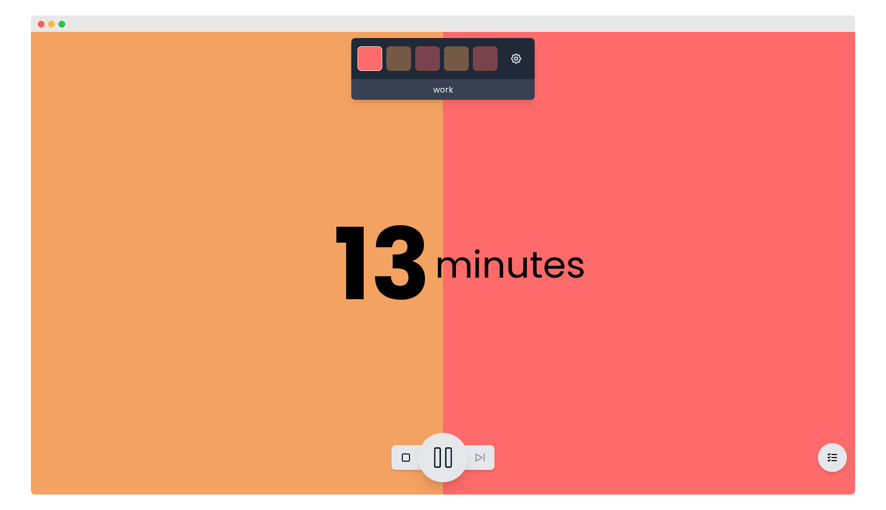

# ⏳ Time Tracking App



## Technologies, packages used

* [**NuxtJS**](https://nuxtjs.org/) (and thus [**VueJS**](https://vuejs.org/))
  * [`vue-i18n`](https://kazupon.github.io/vue-i18n/) for localization
  * [`nuxt/google-fonts`](https://github.com/nuxt-community/google-fonts-module) for Google Fonts support
  * [`pinia`](https://pinia.vuejs.org/) for state management
* [**Tailwind CSS**](https://tailwindcss.com/)
  * [`@tailwindcss/forms`](https://github.com/tailwindlabs/tailwindcss-forms)
* [Tabler Icons](https://tabler-icons.io/) through [`vue-tabler-icons`](https://github.com/alex-oleshkevich/vue-tabler-icons)
* [Workbox](https://github.com/GoogleChrome/workbox) as a PWA service worker
* [`conventional-changelog/standard-version`](https://github.com/conventional-changelog/standard-version) for automatic changelog generation from [conventional commits](https://www.conventionalcommits.org/en/v1.0.0/)

## 🛠  Building or running the app yourself

```bash
# install dependencies
$ yarn install

# serve with hot reload at localhost:3000
$ yarn dev

# generate the final static site
$ yarn generate
```
